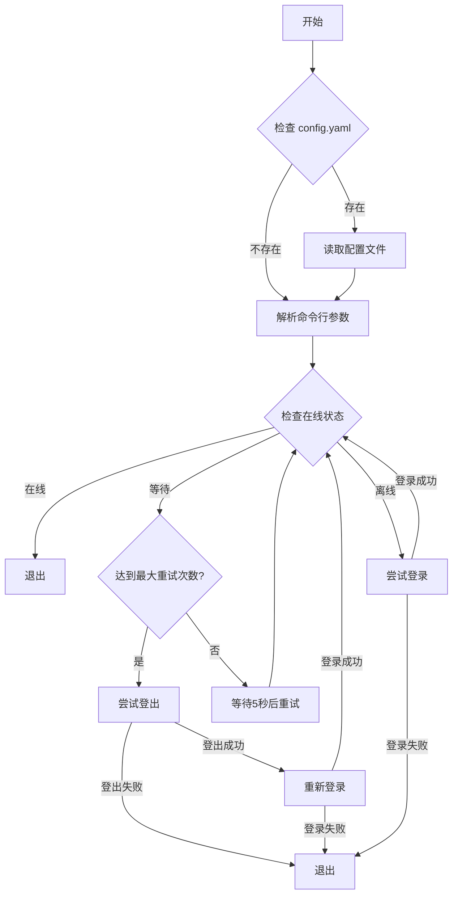

# fzu-network-login

福州大学校园网自动登录脚本

## 可用状态

2024.11.28 确认可用

## QuickStart

```bash
git clone https://github.com/west2-online/fzu-network-login
cd fzu-network-login

mv config.example.yaml config.yaml

# -- 编辑配置文件，填入学号和密码 -- #

python login.py # 执行登录
```

同时支持配置文件和传参，传参优先级更高 e.g.

```bash
python login.py --username={your-username} --password={your-pwd}
```

## User-Agent 自动生成

一般来说不需要更改 UA，如果有需要可以访问 [UserAgent 在线生成工具](https://gongjux.com/userAgentGenerator/) 生成一份

## 工作逻辑

> 由 gpt-4o-2024-11-20 绘制



## 注册为 Systemd 服务

### 创建 Service

```
sudo vim /etc/systemd/system/fzu_network_login.service`
```

写入如下配置，请注意 ExecStart 需要和你的 python 路径一致

> 也可以将其打包为一个 Binary 供执行

```ini
[Unit]
Description=FZU Network Login Service，It will automatically try to login if it is offline

[Service]
Type=oneshot
ExecStart=/usr/bin/python3 /path/to/your/script.py
```

`Type=oneshot`表示在调用中只运行一次，然后停止

### 创建 Timer

Timer 负责定时调用 Service

```
sudo vim /etc/systemd/system/fzu_network_login.timer`
```

写入如下配置

- `OnBootSec`: 定时器启动多久后开始第一次执行
- `OnUnitActiveSec`: 两次服务执行间隔

```ini
[Unit]
Description=Runs FZU Network Login Service every 30 min

[Timer]
OnBootSec=1min
OnUnitActiveSec=30min
Unit=fzu_network_login.service

[Install]
WantedBy=timers.target
```

### 启动服务

```bash
sudo systemctl daemon-reload
sudo systemctl enable fzu_network_login.timer # 自动启动定时器
sudo systemctl start fzu_network_login.timer # 手动启动一次定时器
sudo systemctl status fzu_network_login.timer # 检查定时器状态
```

### 日志和输出

```bash
journalctl -u fzu_network_login.service
```