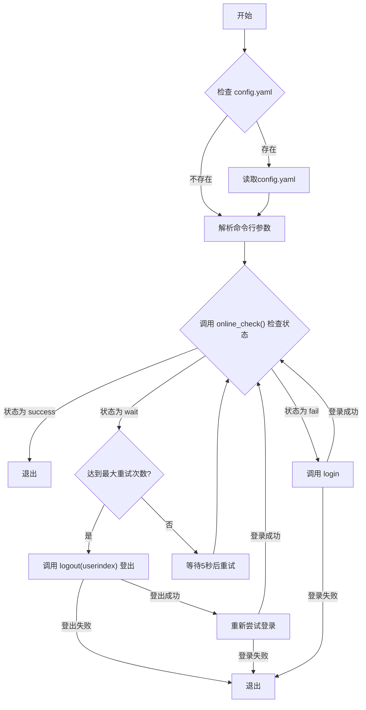

# fzu-network-login

福州大学校园网自动登录脚本，支持 python 调用及 shell 脚本调用。

## 可用状态

2025.9.14 确认可用

```text
❯ python login.py
状态消息: 用户信息不完整，请稍后重试
用户名: {屏蔽}
用户ID: {屏蔽}
用户IP: {屏蔽}
用户MAC: 5ce35{后续不提供}
设备ID: 38393836393062316234383633386563666336633438333562313364396463385f31302e3133322{后续不提供}

Waiting for online status...
状态消息: 获取用户信息成功
用户名: {屏蔽}
用户ID: {屏蔽}
用户IP: {屏蔽}
用户MAC: 5ce35{后续不提供}
设备ID: 38393836393062316234383633386563666336633438333562313364396463385f31302e3133322{后续不提供}

Already online. No need to login.
```

## 依赖

| 方案       | 依赖于                                                     |
| ---------- | ------------------------------------------------------------ |
| python     | `requests`和`pyyaml`包                    |
| shell 脚本 |  `jq`、`yq`、`sed`、`curl`、`awk` 软件 |

> 可以通过`which` 命令查询是否已经安装指定软件
> 建议通过虚拟环境管理 python 包

> 在 python 环境良好的情况下，推荐使用 python 脚本运行及设定自动化流程

> 对于没有上述环境的小米路由器等基于 OpenWrt 系统的路由器，见 [这里](/router/README.md)

## QuickStart

### Shell

```bash
git clone https://github.com/west2-online/fzu-network-login
cd fzu-network-login

mv config.example.yaml config.yaml

# -- 编辑配置文件，填入学号和密码 -- #

bash network-login.sh
```

### Python

```bash
git clone https://github.com/west2-online/fzu-network-login
cd fzu-network-login

mv config.example.yaml config.yaml

# -- 编辑配置文件，填入学号和密码 -- #

python login.py # 执行登录
```

python 脚本同时支持配置文件和传参，传参优先级更高 e.g.

```bash
python login.py --username={your-username} --password={your-pwd}
```

## User-Agent 自动生成

一般来说不需要更改 UA，如果有需要可以访问 [UserAgent 在线生成工具](https://gongjux.com/userAgentGenerator/) 生成一份

## 工作逻辑

> 由 gpt-4o-2024-11-20 绘制



## 注册为 Systemd 服务

### Shell

```bash
# 请先确保 register.sh 和 network-login.sh 位于同一目录
sudo bash register.sh register   # 注册
sudo bash register.sh unregister # 注销

sudo systemctl status fzu-network-login
```

预期输出如下
```bash
ozline@debian-node-3:~/network-login$ sudo systemctl status network-login
○ network-login.service - FZU Network Login Service
     Loaded: loaded (/etc/systemd/system/network-login.service; enabled; preset: enabled)
     Active: inactive (dead) since Mon 2024-12-02 19:53:04 HKT; 1s ago
TriggeredBy: ● network-login.timer
    Process: 1199372 ExecStart=/bin/bash {屏蔽}/network-login.sh (code=exited, status=0/SUCCESS)
   Main PID: 1199372 (code=exited, status=0/SUCCESS)
        CPU: 346ms

Dec 02 19:53:03 debian-node-3 systemd[1]: Starting network-login.service - FZU Network Login Service...
Dec 02 19:53:04 debian-node-3 bash[1199372]: Status Message: 获取用户信息成功
Dec 02 19:53:04 debian-node-3 bash[1199372]: Username: {屏蔽}
Dec 02 19:53:04 debian-node-3 bash[1199372]: User ID: {屏蔽}
Dec 02 19:53:04 debian-node-3 bash[1199372]: User IP: {屏蔽}
Dec 02 19:53:04 debian-node-3 bash[1199372]: User MAC: {屏蔽}
Dec 02 19:53:04 debian-node-3 bash[1199372]: Device ID: {屏蔽}
Dec 02 19:53:04 debian-node-3 bash[1199372]: Already online. No need to login.
Dec 02 19:53:04 debian-node-3 systemd[1]: network-login.service: Deactivated successfully.
Dec 02 19:53:04 debian-node-3 systemd[1]: Finished network-login.service - FZU Network Login Service.
```

### Python

#### 创建 Service

```
sudo vim /etc/systemd/system/fzu-network-login.service
```

写入如下配置，请注意 ExecStart 需要和你的 python 路径一致

> 也可以将其打包为一个 Binary 供执行

```ini
[Unit]
Description=FZU Network Login Service，It will automatically try to login if it is offline

[Service]
Type=oneshot
ExecStart=/usr/bin/python3 /path/to/your/script.py
```

`Type=oneshot`表示在调用中只运行一次，然后停止

#### 创建 Timer

Timer 负责定时调用 Service

```
sudo vim /etc/systemd/system/fzu-network-login.timer
```

写入如下配置

- `OnBootSec`: 定时器启动多久后开始第一次执行
- `OnUnitActiveSec`: 两次服务执行间隔

```ini
[Unit]
Description=Runs FZU Network Login Service every 30 min

[Timer]
OnBootSec=1min
OnUnitActiveSec=30min
Unit=fzu-network-login.service

[Install]
WantedBy=timers.target
```

#### 启动服务

```bash
sudo systemctl daemon-reload
sudo systemctl enable fzu-network-login.timer # 自动启动定时器
sudo systemctl start fzu-network-login.timer # 手动启动一次定时器
sudo systemctl status fzu-network-login.timer # 检查定时器状态
```

### 日志和输出

通过 journal 查看日志即可

```bash
journalctl -u fzu-network-login.service
```
